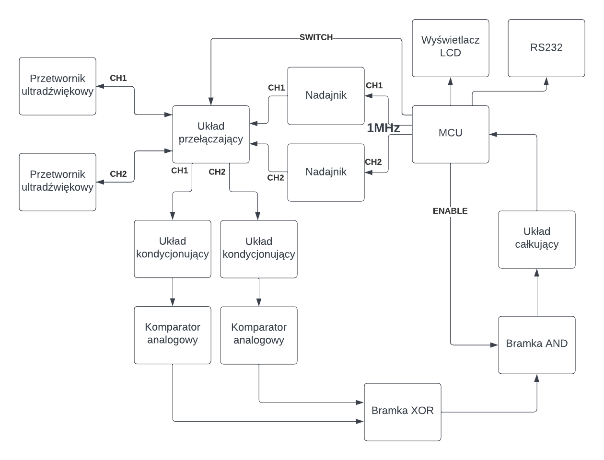
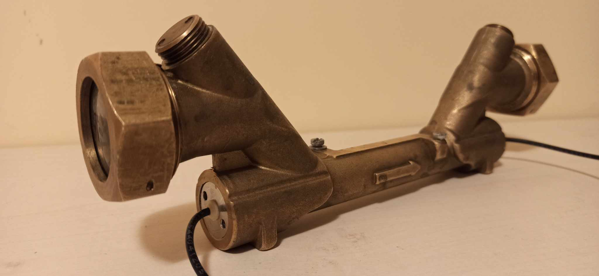
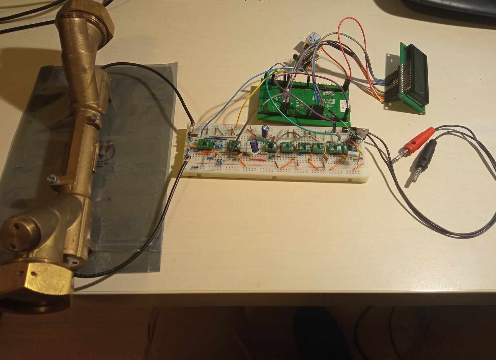

# Ultrasonic_water_flowmeter
A device that measures the total flow of water through a pipe. 
The circuit was implemented on a breadboard. 
Water flow measurement using the sound
carrying effect and an analog conditioning circuit.

The device has the following parameters:
- **Power supply voltage:** 7.5V
- **Maximum flow:** 870 cm3/s
- **Measurement frequency:** 2 measurements/s
- **Accuracy:** ~5%
- **Water temperature measurement range:** 10-30°C

The ultrasonic transducers were placed opposite each other and the water supply was provided by the two upper holes of the pipe.

